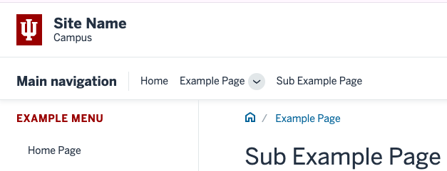
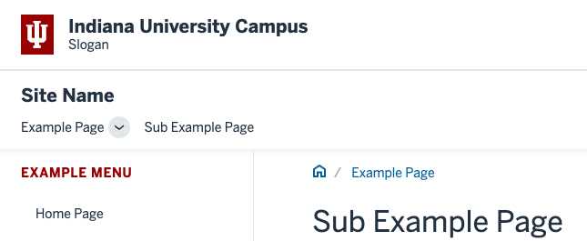
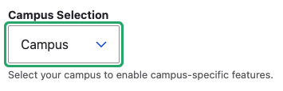
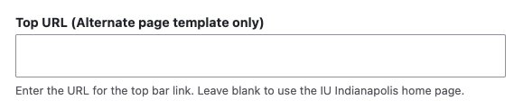
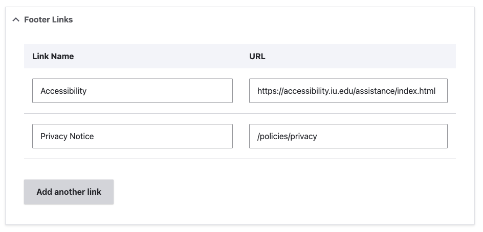
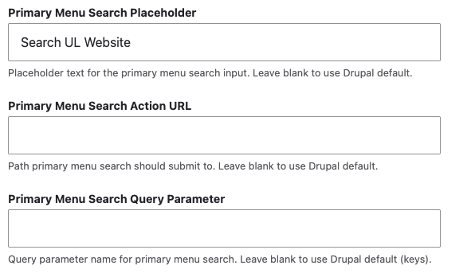
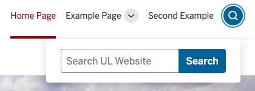

# IU Indianapolis Libraries Rivet Custom Drupal Themes

Drupal sub themes built on the [Drupal's stable9 base theme](https://www.drupal.org/docs/develop/theming-drupal/sub-theming-using-stablestable-9-as-a-base-theme) 
using [IU Rivet Design System](https://rivet.iu.edu/)

## Sections

* [Features](#features)
* [Custom Blocks and Menus](#custom-blocks-and-menus)
* [Custom Node Types](#custom-node-types)
* [Configuration](#configurations)
* [Development](#development)

## Features

Several options for the layout of the theme are available at __Administration :: Appearance :: Appearance settings :: IU Indianapolis Libraries__.

### Default and Alternative Header

Two header options are available using the __Template Option__

#### Default Header



#### Alternative Header



### Campus Selection

A dropdown list set a specific campus or no campus for use in both versions of the header.



### Top URL (Alternative Header only)

If using hte Alternative Header, the top title link next to the IU Trident can be assigned a custom URL.



### Place Slogan over Campus (Alternative page template only)

For use when you need to place a school or department over its campus. 
Alternative Top URL still applies.

### Enable Dark Mode Option

Toggling this option on will allow browser preference and/or javascript to enable dark mode theme.

### Footer Color

Using the __Footer Option__, the background color for the bottom IU footer can be set. Options include White and Crimson.

### Footer Links

Multiple footer link can be added between the IU Footer's Trident and Copyright link. The order of these footer links will be displayed left to right.



## Custom Blocks and Menus

### Rivet Featured Hero

A block type for [IU Rivet Heroes](https://rivet.iu.edu/components/hero/) is available. These blocks would generally be used in the __Featured__, __Content__, and __Footer__ regions. Available fields include:

* Eyebrow
* Body
* Action Link
* Image
* Image Caption
* Dark Background toggle
* Background Image 

### Rivet Card

A block type for [IU Rivet Cards](https://rivet.iu.edu/components/card/) is available. Generally these blocks would be added to the __Sidebar second__ region. Fields available include:

* Card Title
* Card Content
* Title Link
* Image
* Eyebrow
* Metadata

### Top Navigation Menu | Block

Special features are available for a menu that meets the following criteria:

* Is named `Top Navigation` or `Primary Navigation`
* Block for this menu is placed in `Primary menu` region

Besides the menu links, an optional search icon and box are available. Settings for this search box are in the IU Indianapolis Libraries theme settings. Options include enabling, form action, text field name, and text field placeholder. Leaving action and name fields empty will result in default Drupal search page.



__Example Result__



## Custom Node Types

### Section Page

This node type allows for multiple sections to be created. Each section will take full width of browser, but with content limited to usual extra-large container. Order of sections can be changed
through interface and background / font colors can be set for each section.

Section pages work best with no sidebars.

Section pages rely on custom theming and [Paragraphs Module](https://www.drupal.org/project/paragraphs)

## Configurations

### Favicon

Both the IU Trident and the UL Window favicons are included in the site. Creating a soft link in the root directory of a sub-theme can be used to point to the wanted favicon. The soft link must be named __favicon.png__. The images are located in `iui_libraries/images/favicons/`.

## Development

### SASS Styling

SASS is deployed for creating all internal CSS files. This includes the primary `style.css` for the theme and `libguides.css` needed for SpringShare Libguides.

__DO NOT__ edit `css/*.css` directly. Instead edit files in the `sass` directory then compile.

`sass` must be installed on development environments for compiling CSS files. Use the following command while editing scss files to automatically compile when edits are saved:

```
cd [theme_root]
sass --watch sass:css
```
